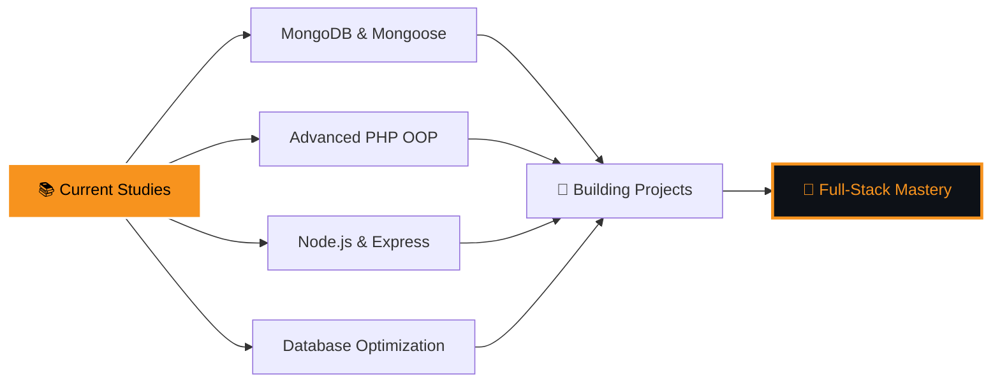

#  Hi there, I'm **Ilyas Dahss**

<div align="center">
  
</div>


### 💫 About Me

```javascript
const ilyas = {
    pronouns: "He" | "Him",
    location: "Rabat, Morocco 🇲🇦",
    currentFocus: "Full-Stack Development",
    school: "ISTA NTIC Rabat",
    
    currentlyLearning: [
        "MongoDB & Mongoose",
        "Advanced PHP & OOP",
        "Node.js & Express.js",
        "Database Optimization"
    ],
    
    askMeAbout: [
        "Web Development", 
        "JavaScript", 
        "PHP", 
        "Database Design",
        "Chess Strategies ♟️"
    ],
    
    funFact: "I debug with console.log() and I'm proud of it! 🐛"
};
```

<br clear="both">

## 🚀 Tech Stack & Tools

<div align="center">

### Languages


### Frontend


### Backend & Databases  


### Tools & Others


</div>

## 📊 My Skills

<div align="center">

### Languages


### Frontend


### Backend & Databases  


### Tools & Others


</div>

### 🏆 Project Highlights

| Project | Description | Tech Stack | Status |
|---------|-------------|------------|--------|
| 🌤️ **Weather Dashboard** | Real-time weather data with beautiful UI | Node.js, Express, API Integration | ✅ Complete |
| ♟️ **Chess Game** | Interactive chess with move validation | Vanilla JavaScript, CSS3 | ✅ Complete |
| 🛒 **Stock Management** | Inventory system for businesses | PHP, MySQL, Bootstrap | 🔄 In Progress |
| 🔍 **RPG Creature Search** | Search engine for game creatures | PHP, JSON, AJAX | 🔄 In Progress |


## 🏆 GitHub Trophies

<div align="center">
  
</div>

## 💻 Current Learning Journey



## 🎮 Fun Zone

<details>
<summary>🎯 Quick Facts About Me</summary>

- 🔥 I can solve a Rubik's cube in under 2 minutes
- ♟️ Chess rating: Still climbing! 
- 🌙 Night owl - my best code happens after midnight
- ☕ Coffee dependency level: **MAXIMUM**
- 🎵 Coding playlist: Lo-fi hip hop + epic movie soundtracks
- 💡 Dream project: AI-powered chess tutor

</details>

<details>
<summary>💬 Random Dev Quote</summary>
<br>

<div align="center">
  
</div>

</details>

## 🤝 Let's Connect!

<div align="center">

[](https://linkedin.com/in/ilyas-dahss-a08637337)
[](dahssilyas@gmail.com)
[](https://github.com/DAHSSILYAS)
[](https://yourportfolio.com)

</div>

---

<div align="center">
  
  
  ### 💖 Thanks for visiting my profile!
  
  
</div>


---

<div align="center">
  <h3>🚀 "Building the future, one commit at a time" 🚀</h3>
</div>
